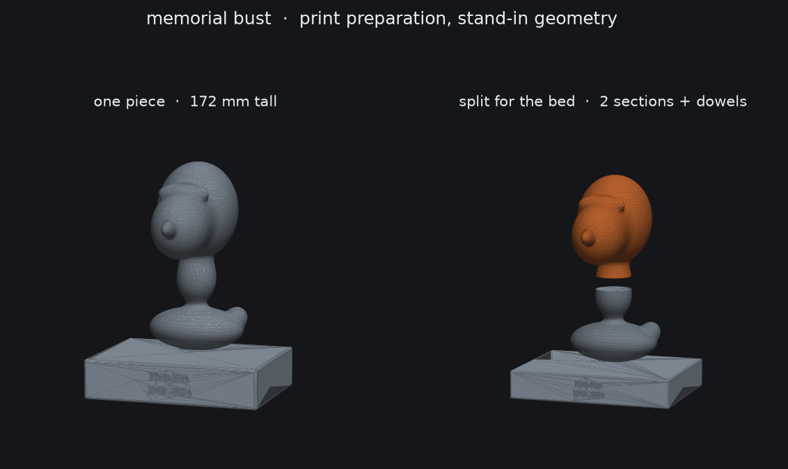

# Memorial bust

Turning photographs of a person into a bust you can print. This directory
holds the half of that job that is deterministic — taking a reconstructed
head mesh and making it printable. The reconstruction itself runs on your
own machine; `setup.sh` prepares it.



*Stand-in geometry. The blob above is `make_test_head.py`, which exists so
the pipeline can be tested without using someone's face as a test fixture.*

## Read this before choosing a route

The pipeline is honest work. The reconstruction is not a solved problem,
and for a memorial the gap matters more than usual.

Photogrammetry — real, faithful reconstruction — needs twenty or more
photographs taken around the head in one session, in even light. That
material almost never exists for someone who has died, because nobody
photographs a person that way.

From two to five ordinary portraits, what you get is a **statistical face
steered by the photographs**. The front of the face lands close. Ears, the
back of the head and hair are not in the photographs, so the model invents
them from an average of the faces it was trained on. That is not a bug to
be tuned away; the information is simply absent.

For a memorial this cuts deeper than for a prop. Families recognise detail
that no one else registers — the exact set of a jaw, the asymmetry of one
eyelid. A face that is ninety percent right can read as *wrong* in a way
that hurts more than no bust at all. The route that tends to work is an AI
base plus a sculpting pass with the photographs open alongside, and that
pass is human judgement.

## Photographs worth using

Two or three good ones beat ten poor ones. Look for:

- **The original file**, not a screenshot, not a WhatsApp forward. Every
  re-share re-compresses. If the only copy is a print, scan it flat at 600
  dpi or more — do not photograph it at an angle.
- **The face sharp and reasonably large in the frame.** Detail that is not
  in the pixels cannot be recovered from them.
- **Even light.** A hard shadow across half the face gets read as geometry;
  the model will build the shadow into the cheekbone.
- **Different angles of the same person at the same age.** Front, and a
  three-quarter view if one exists. A profile is worth a great deal.
- **Neutral expression**, eyes open.

Avoid, or expect trouble from: selfies at arm's length (the wide lens
widens the nose and shrinks the ears — it changes the proportions of the
face, so the reconstruction inherits the distortion), sunglasses, heavy
filters or beauty modes, and mixing photographs from decades apart, which
gives the fit two different people to average.

## What this directory does

| File | |
|---|---|
| `setup.sh` | Prepares a machine. `--with-recon` adds the reconstruction stack. |
| `prepare_bust.py` | Mesh in, print-ready STLs out. Runs under Blender. |
| `make_test_head.py` | Generates the stand-in bust used to test the pipeline. |
| `preview_bust.py` | Renders the result. |

```bash
./setup.sh
blender --background --python prepare_bust.py -- \
    --input head.obj --name "Maria Silva" --dates "1948 - 2024" \
    --height 150 --plinth 30
```

It will: stand the mesh upright, scale it so the head is the height you
asked for, voxel-remesh it watertight, cut a flat base, add a plinth with
the name and dates engraved into the front, check the footprint against the
bed, split it into sections with dowel holes if it is too tall, decimate to
a sane triangle budget, and report dimensions, manifoldness and a filament
estimate per part.

Useful flags: `--y-up` if the input is lying on its back, `--fit-bed` to
scale down rather than fail, `--hollow 2.5` to shell it (resin only — on
FDM let the slicer do infill), `--bed` for a printer that is not an
A1 Mini.

## Verified

Run against the stand-in head, on this pipeline:

- 142 mm head on a 30 mm plinth → one piece, 133 × 115 × 172 mm, manifold,
  about 183 g of PLA.
- 185 mm head → two sections of 107 mm, both manifold, plus a Ø6 dowel;
  holes at Ø6.5 for a 0.25 mm fit.
- A 240 mm bust is **refused**, correctly: its footprint is 224 mm against a
  180 mm bed, and splitting in Z cannot rescue a base that is too wide.

Nothing has been printed, and no real face has been through it.

## Things that cost time here

- **Blender's OBJ importer assumes the file is Y-up and rotates it.** A bust
  imports lying on its back, and `--height` then scales it by its depth. The
  loader now takes the file's axes literally; rotating is `--y-up`'s job,
  where it is a decision instead of a surprise.
- **Order matters for the footprint check.** Checking the head against the
  bed before adding the plinth passes a model that does not fit, because the
  plinth is the widest part.
- **Engraved text has a legibility floor.** A 0.4 mm nozzle needs roughly
  6 mm of cap height before a normal typeface has 0.7 mm strokes. Two lines
  therefore need about 26 mm of plinth. Below that the letters fill in, so
  the script warns rather than engraving mush.
- **Voxel remesh is the right tool for scan output.** Repairing holes,
  flipped normals and self-intersections one by one is a losing game;
  resampling the volume is not. The cost is detail below the voxel size,
  which at 0.6 mm is detail the nozzle could not print anyway.
