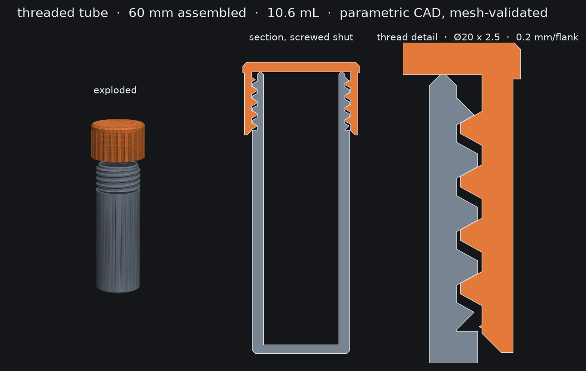

# Threaded tube

A 60 mm screw-top tube: knurled cap, Ø20 x 2.5 trapezoidal thread, 10.6 mL.
Recreated from an Instagram reel where the same object was modelled by
prompting an AI inside Blender.



The difference is the method, not the result. Blender is a mesh sculptor:
"make the thread fit" is a request it can only answer by eye. Here the part
is a **parametric solid model** — every dimension is a named constraint in
`generate.py`, the fit is arithmetic, and the whole thing rebuilds in 8
seconds when a number changes.

## Files

| File | What it is |
|---|---|
| `generate.py` | The model. All dimensions live at the top. |
| `validate.py` | Mesh checks + a virtual screw-on test. |
| `preview.py` | Renders `preview.png`. |
| `tube-body.stl` / `tube-cap.stl` | Print-ready, already oriented on the bed. |
| `tube-body.step` / `tube-cap.step` | B-rep, for editing in real CAD. |

```
pip install -r requirements.txt
python3 generate.py && python3 validate.py
```

## Specification

| | |
|---|---|
| Assembled | Ø24 x 60 mm |
| Body | Ø20 x 58 mm, 2.25 mm wall (1.25 at the neck), 1.8 mm floor |
| Cap | Ø24 x 15 mm, 24 knurled flutes |
| Thread | Ø20 x 2.5 mm trapezoidal, single start, right hand, 4 turns |
| Clearance | 0.20 mm radial per flank, 0.10 mm axial |
| Capacity | 10.6 mL |
| Material | 9.7 cm³ solid — roughly 6 g PLA at 15 % infill |

Printer target is the A1 Mini with a 0.4 mm nozzle at 0.20 mm layers. The
thinnest wall in the part is 1.25 mm at the neck, above the 1.20 mm floor
the `bambu-3d-maker` skill sets for that nozzle.

## Printing

Both parts print flat on the bed with no supports, as exported:

- **Body** stands upright, closed end down. The thread crests are the only
  overhang and they self-support at this pitch.
- **Cap** is exported closed-top-down, so the internal thread prints as
  wall geometry and there is no ceiling to bridge over the cavity.

3 walls, 15 % infill, no brim. If the cap binds, widen `RAD_CLEAR` to 0.25
and regenerate — do not sand the thread.

## Validation

`validate.py` refuses to take the geometry on faith. Per part it checks
watertightness, winding, single shell, volume and bounding box against the
spec. Then it does the test that actually matters:

> Screw the cap onto the body in software, rotate it through a full turn at
> the seated height, and measure the solid intersection at each phase.

A thread pair that meshes has exactly one phase per turn where the parts
only touch. That is what comes back — 0.000 mm³ of interference at 102°,
and up to 141 mm³ of flank collision everywhere else. Interference at
*every* phase would mean the thread does not fit, which is the failure a
visual model hides until the print is done.

## Two things that will bite you

Both cost real debugging time here, and neither raises an exception:

1. **A helical sweep will not fuse to its core with an exact boolean.**
   The ridge meets the core along a long tangential seam and OpenCascade
   quietly returns the first operand unchanged — no error, just a smooth
   cylinder where the thread should be. Fuse with a fuzzy tolerance
   (`tol=1e-4`) and sink the thread root ~0.15 mm into the core.
2. **`revolve()` takes its axis in workplane-local coordinates.** On the
   XZ plane, the global Z axis is `(0, 1, 0)`. Passing `(0, 0, 1)` revolves
   around global Y and returns a zero-volume solid, again silently.

The general lesson: check volume after every boolean. A B-rep kernel that
fails by returning plausible geometry is worse than one that throws.
